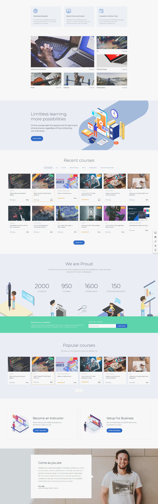
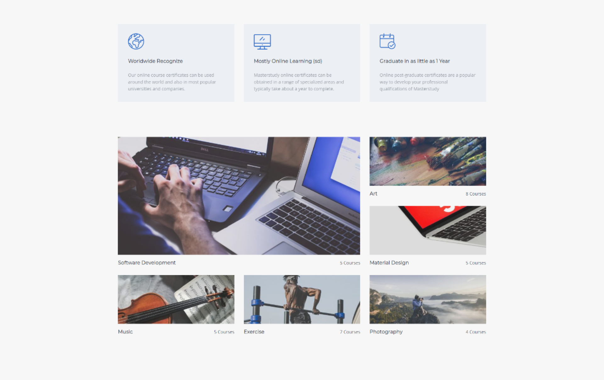
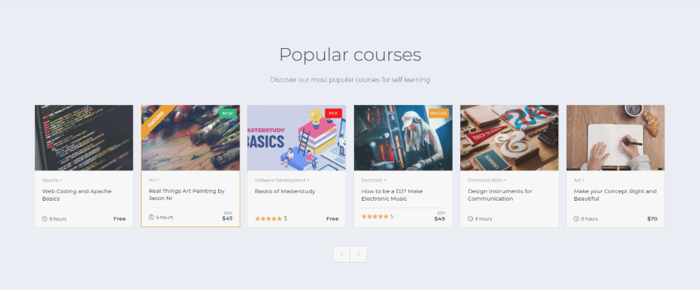
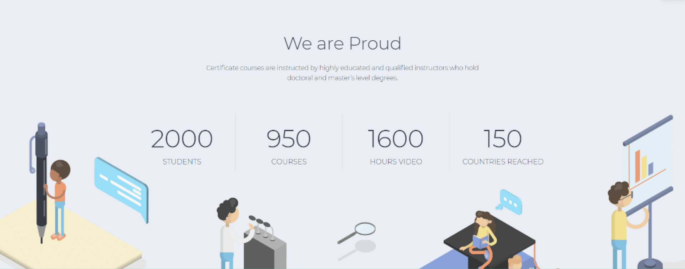
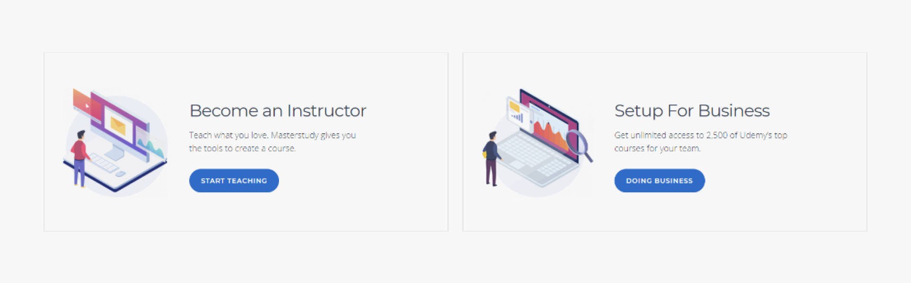

# Project name - Master Study

---

## - Breve descrizione del progetto

  Riprodurre il layout proposto della page "Master Study" themes;

### * Tecnologie da adottate:  HTML/CSS/VueJs

### * Specifiche richieste: Aggiungere Header e Footer con VueJs e reare una struttura dati che consenta di inserire i link nelle navbar

---
---

## Fase 1 - Analisi preliminare del layout assegnato

Individuazione delle macroaree di sviluppo:

  1. **Header**
  2. **Main**
  3. **Footer**

Che successivamente andremo a suddividere nelle loro sezioni costituenti in base alla loro funzionalità.
Simultaneamente si inizia a creare una prima bozza di organigramma strutturale dove allocare le risorse in cartelle.
Project - "masterstudy"

- index.html
- assets
  - css - cartella per lo style
    - style.css
  - js - cartella javascript
    - fontawesome - script per collegamento fontawesome
    - main.js
  - img - cartella risorse immagini suddivise per sottocartelle
    - eader
    - main
    - footer

---
---

### 1.1 - Heade

  Sudduvudimo l'header in una
  
- Navbar top
  - contenente una selct per la scelta della lingua del sito
  - un sezione di controllo per funzionalità aggiuntive
  - una sezione per i collegamenti social e altre piattaforme
  
Subito dopo è presente una sezione "Jumbotron", al cui interno ritroviamo

- una **sub-navbar** contenente logo - e compani movie- search-bar con category select - due collegamenti alle aree "istructor" ed "enterprise" - la sezione "Log in" "Signu up" ed un segnapage
- sotto area informativa del jumbotron suddivisa in due sottosezioni
  - una **info_box** alla sinistra, formata da un "title" - slogan - button
  - una image composta alla cui poter associare degli effetti differenziati di movimento o transizione diversificate

---

### 1.2 - Main

Il Main è il corpo del page, pur essendo una macroarea, al suo interno ritroviamo varie sottosezioni:

#### 1.2.1 Main - "Offer Preview"

- Una **"offer preview"** dove troviamo i punti di forza del prodotto, quali il riconoscimento della certificazione, le tempistiche garantite e alcune proposte, suddivise per macrosettori, delle offerte formative proposte. Le informazioni sono stilizzate a loro volta in due microaree

  - Nella prima sotto forma di card dello stesso style ( icona - titolo - paragrafo), vengono brevemente riepilogati alcuni punti forti
  - Mentre nella seconda, sotto forma di immagini ritroviamo un accenno all'offerta formativa tematizzata dei corsi proposti

#### 1.2.2 Main - "Info Banner"

- **info banner** - con una struttura molto simile al**box** presente nel **jumbotron**, quindi due sezioni, una sinistra con **info_box** (titolo - descrizione - button) e destra - banner_image.

#### 1.2.3 Main - "Showcase Products - Recent Courses"

In questa sezione è presente una raccolta dei prodotti con una sub-row dove poter selezionare le categorie d'interesse, ed una vetrina dei prodotti, stilizzati sotto forma di card, al cui interno ritroviamo  

- Una image,(in alcuni casi è presente un bage che li classifica come "new" - "hot" - "special")
- La macro-categoria a cui è associato il course
- La durata o la sua valutazione
- Il costo, e la dove un eventuale sconto o proposto in versione "Free"

button centrale "Show all"

#### 1.2.4 Main - "Our Statistics"

In questa area vengono messi in evidenza i "numeri" rilevanti che mettono in evidenza l'affidamilità del prodotto in funzione dei volumi erogati, mediante 4 macro indicatori.
Questa sezione di compone di un bacgrounk-color, un titolo un breve slogan descrittivo e i 4 indicatori stilizzati in 4 macro colonne, contenente in ciascuna il valore numerico e l'indicatore rappresentativo di riferimento.
Come cornice alla sezione ritroviamo un'immagine posizionata assolutamente nella parte inferiore.

#### 1.2.5 Main - "Newsletter"

Questa sezione permette di interagire con l'utente, permettendogli di esser inserito nella emailing list, per ricevere eventuali offerte, news, offerte, ecc.
La sia struttura può esser sintetizzata in due colonne

- Una sinistra in cui ritroviamo un sub-title e un breve messaggio descrittivo
- Alla destra ritroviamo un label che da indicazioni sintetiche all'utente del tipo di dato da poter inserire, e successivamente al di sotto, il tag input email che permette l'inserimento della mail con i corretti criteri associativi ed il tasto submit per l'invio, e quindi iscrizione alla emailing list.

#### 1.2.6 Main - "Carousel Polular Courses"

Questa sottosezione mostra, sotto forma di "carosel" - le card dei vari corsi, in particolare dei più poplari.
Lo stile delle card è quello che ritroviamo nella sottosezione - **"Showcase Products."**

La sua macrosctruttura è composta di un colore di background che ne identifica l'area, un titolo ed un sub-titolo descrittivo ed il "carousel" con i relativi tasti di navigazione.

#### 1.2.7 Main - "Sectorized Offers"

Ritroviamo due **box_card** di eguale struttura e dimensione -  con un elemento grafico composto da un'immagine nella parte sinistra e una descrizione del prodotto specializzato nella parte destra. La info section si articola con un Titolo - una breve descrizione ed il button di collegamento.

#### 1.2.8 Main - "Testimonial - Cases History"

Questa sottosezione riporta una testimonianza ( o più di una scorrevole a tempo - potenziale implementazione successiva)

- Immagine di background
- Bubble rettangolare in css con al suo interno un titolo della testimonianza, il testo della testimonianza , nome cognome autore, carica attualmente ricoperta, azienda.

---
---

### 1.3 Footer

Il Footer è suddiviso in 4 macro colonne contenenti a loro volta

- **About** - in cui ci sono riferimenti sull'azienda e i riferimenti stilizzati sotto forma di icone, agli elementi social ad essa connessi
- **Contact** - come contattare l'azienda. Indirizzo, telefono, fax, info-email
- Page - collegamenti a varie arie d'interesse del sito
- Blog - presenta una previw di due articoli presenti nel blog.

---
---

## Fase 2 - Analisi di dettaglio -Stilistico-funzionale

Dopo la fase di analisi di massima del layout e delle sue macroaree, si passa ad una rilevazione e realizzazione delle stesse, andando a determinare gli elementi necessari alla loro realizzazioni, come colorazioni, dimensionamenti posizionamenti funzionalità e sviluppo della relativa struttura da impostare nel js per la generazione funzionale degli elementi html e dare interattività alla pagina.

In questa parte lo sviluppo dello "scheletro di base" della parte Html va di pari passo con la generazione della struttura da impostare nel file javascrip, all'interno del quale, sfruttando la metodologia di VueJs cercheremo di render dinamica la creazione delle sezioni similari, in modo da render più flessibile eventuli aggiunte o sviluppi futuri di sezioni simili gia presenti, come 'aggiunta di una nuova card prodotto un nuovo elemento della navbar menu o elemento del footer.

## 2.1 Inizializzazione file index.html e main.js

Andiamo ad inizializzare il file effettuandi i collegamenti essenziali per poter avviare la prima scittura di codice e bozza strutturale.
Collegamenti base:

- Link di collegamento file css style.css locale;
- Script di collegamento alla libreria ajax - sinstassi Mustache-compatible;
- Collegamento a "fontawesome icon" da script locale;
- Script di collegamento a Vue.js mediante cdn;
- Script di collegamento al file locale javascript;

Prima bozza strutturale partendo dalle macrosezioni - header - main - footer;
